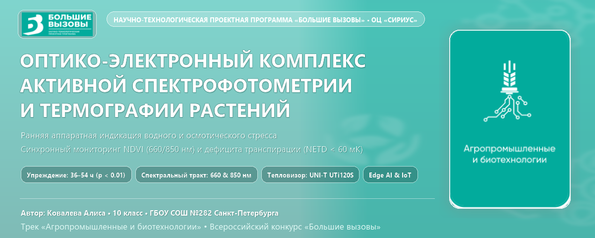
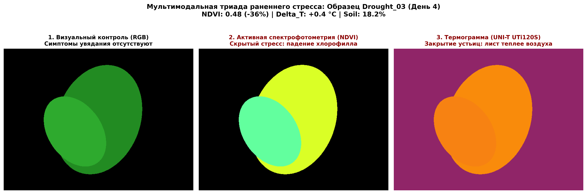
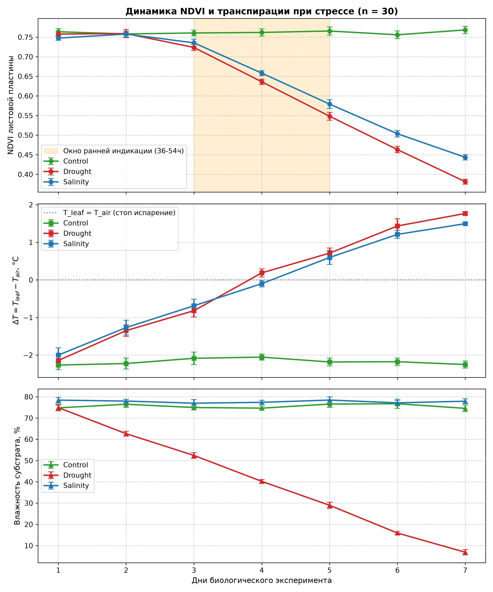
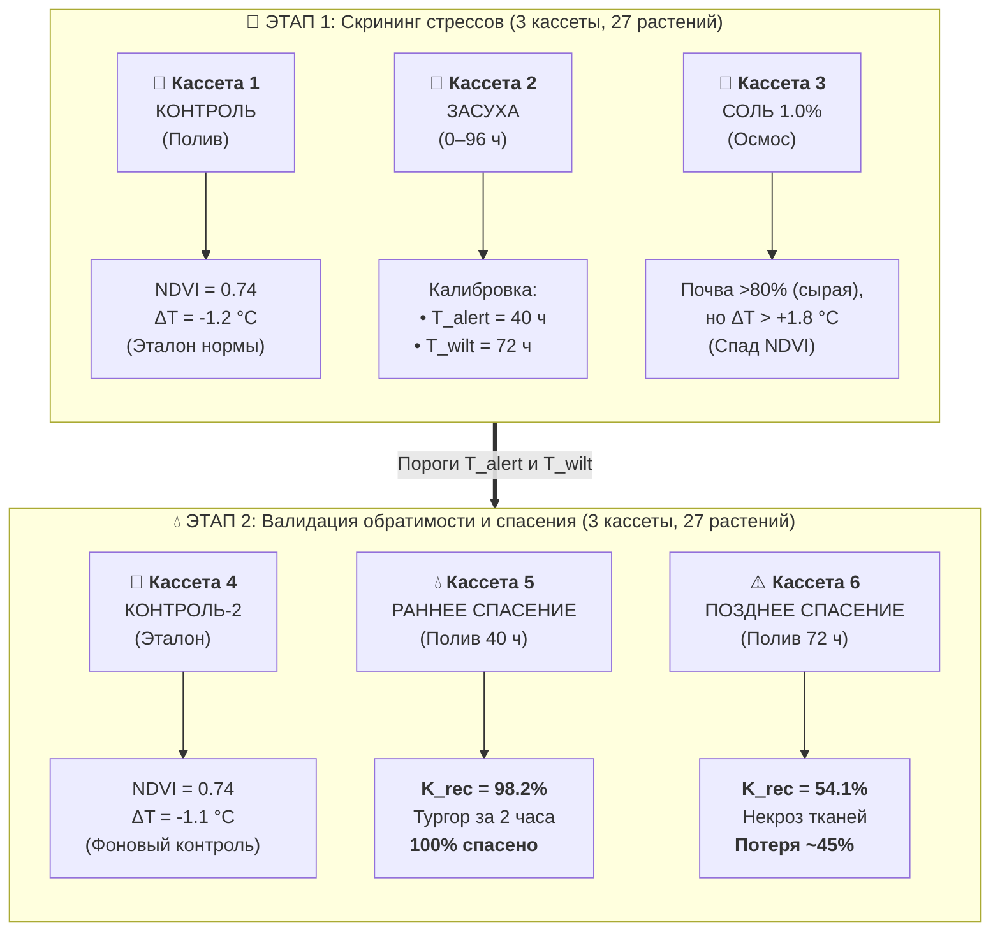

<div align="center">

<a href="https://konkurs.sochisirius.ru/">
  
</a>

<br><br>

# Оптико-электронный комплекс активной двухволновой спектрофотометрии и термографии для ранней индикации стресса растений

[](https://konkurs.sochisirius.ru/)
[](https://konkurs.sochisirius.ru/)
[](https://opensource.org/licenses/MIT)
[](https://www.python.org/)
[]()
[](hardware/laser/)

</div>

---

### 📊 Проект в цифрах (в формате Всероссийского конкурса «Большие вызовы»)

| Показатель | Значение | Научно-технологическое обоснование |
| :--- | :---: | :--- |
| **Опережение макросимптомов** | **36–54 ч** | Фиксация дегидратации мезофилла и спада транспирации до видимого увядания |
| **Спектральный тракт** | **660 / 850 нм** | Поглощение хлорофилла *a/b* (660 нм) и плато клеточного рассеяния NIR (850 нм) |
| **Термометрия листа** | **UNI-T UTi120S** | $120 \times 90$ пикс, $\text{NETD} < 60$ мК, детекция $\Delta T = T_{\text{leaf}} - T_{\text{air}}$ (транспирационный стресс) |
| **Достоверность стресса** | **$p < 0.01$** | Статистическая достоверность корреляции индекса NDVI с дефицитом массы кассеты |
| **Конкурсный лимит текста (п. 2.10)** | **15 295 знаков** | Строго $\le 20\,000$ знаков без пробелов (76.5% официального лимита Сириуса) |
| **Конкурсная презентация** | **15 слайдов** | Ровно 15 слайдов 16:9 (100% лимита регламента Приказа Фонда № 349-ОД) |
| **Раскрой лазерного бокса** | **$760 \times 760$ мм** | 4 мм берёзовая фанера, 6 заготовок $240 \times 240$ мм под Acmer S1 Pro 20W |

> **Разработка аппаратно-программного комплекса активной стробоскопической двухволновой спектрофотометрии ($\lambda_1 = 660$ нм, $\lambda_2 = 850$ нм) и инфракрасной термографии для неинвазивной детекции водного и осмотического стресса сельскохозяйственных культур на 36–54 часа раньше проявления визуальных макросимптомов.**

---

## 👩‍🔬 Авторство и научно-техническое досье

* **Автор проекта**: **Ковалева Алиса** (Kovaleva Alisa), учащаяся 10 класса
* **Образовательное учреждение**: ГБОУ СОШ №282 Кировского района Санкт-Петербурга
* **Научное направление**: Физиология стресса растений, фотобиология, биофотоника, Edge AI, высокоточное фенотипирование.
* **Целевой конкурс**: Всероссийский конкурс научно-технологических проектов **«Большие вызовы»** (Образовательный центр «Сириус»), трек *«Агропромышленные и биотехнологии»*.
* **Контактный Email автора**: [ezicvtumane@gmail.com](mailto:ezicvtumane@gmail.com)

---

## 📌 Актуальность и решаемая проблема

1. **Задержка визуальной диагностики (48–72 ч)**:  
   В закрытых агробиотехнологических системах (сити-фермы, фитотроны, гидропоника) дефицит влаги традиционно фиксируется по потере тургора (увяданию) и хлорозу листьев. К этому моменту в растительных тканях уже развиваются необратимые патологические деструкции: плазмолиз клеток мезофилла, деградация белковых комплексов фотосистемы II (PSII) и резкое падение урожайности.
2. **Ограниченность традиционных почвенных датчиков**:  
   При засолении почвенного субстрата (осмотический стресс) влажность почвы остается физически высокой ($>75\%$). Контактные емкостные и кондуктометрические датчики сигнализируют о нормальной влажности, в то время как корни растения не способны поглощать воду из-за осмотического градиента (физиологическая засуха).
3. **Недостатки бытовых мультиспектральных камер**:  
   Системы с пассивными светофильтрами страдают от перекрестного оптического наложения полос матрицы Байера, температурного дрейфа и сильной чувствительности к колебаниям комнатного освещения.

### 💡 Научная гипотеза
> Комплексный мониторинг оптической плотности листа в полосе поглощения хлорофилла *a/b* ($\lambda = 660$ нм) и плато рассеяния губчатого мезофилла ($\lambda = 850$ нм) в комбинации с тепловизионной регистрацией прекращения транспирационного охлаждения ($\Delta T = T_{\text{leaf}} - T_{\text{air}}$) позволяет **статистически достоверно ($p < 0.01$) фиксировать наступление стресса за 36–54 часа до появления видимых симптомов**.

> [!NOTE]
> **Текущая аппаратная реализация и статус компонентов (Стадия испытательного прототипа):**  
> В текущей версии программного обеспечения реализована временная испытательная схема оптического стробирования (калибровочная галогенная подсветка с демультиплексированием оптических каналов Red 660 нм / NIR 850 нм, интерактивная привязка термограмм UTi120S с автоматическим OCR-распознаванием температуры листа и системная служба удержания реле на Pin 7/Pin 10). Данная схема обеспечивает непрерывный сбор первичных калибровочных рядов и будет аппаратно доработана после поступления заказных компонентов (дискретных узкополосных твердотельных излучателей 660 нм и 850 нм с интерференционными фильтрами полосы пропускания FWHM $\le 10$ нм).

---

## 🔬 Принцип работы и архитектура комплекса

```
 [Образец растения в боксе]
         |
         +---> [Освещение: Стробирование через 2-канальное реле]
         |        |-- Вспышка 850 нм NIR (Питание: Mini360 #1, 3.3 В)
         |        +-- Вспышка 660 нм Deep Red (Питание: Mini360 #2, 550 мА, 2.45 В)
         |
         +---> [USB NoIR Камера V4L2] (Ручная экспозиция = 120, AWB выключен)
         |        |-- Кадр 1: Фоновая комнатная засветка (I_фон)
         |        |-- Кадр 2: Отражение в NIR 850 нм (I_850)
         |        +-- Кадр 3: Отражение в Red 660 нм (I_660)
         |
         +---> [UNI-T UTi120S Тепловизор] (NETD < 0.06 °C, e = 0.98)
         |        +-- Регистрация T_leaf и T_air -> расчет Delta_T
         |
         +---> [ADS1115 16-bit I2C + Емкостные датчики влажности v1.2]
                  +-- Непрерывный Ground-Truth контроль влажности субстрата
```

### Физическая демультиплексизация байеровской матрицы (Bayer CFA Demultiplexing)
В отличие от наивного преобразования цветного изображения в градации серого ($Y = 0.299R + 0.587G + 0.114B$, которое занижает красный сигнал в 3.3 раза), в алгоритме реализовано физическое разделение каналов кремниевого сенсора:
* **Канал 660 нм (Deep Red)**: извлечение чистого красного подуровня матрицы ($R = \text{frame}[:, :, 2]$), где сосредоточено поглощение хлорофилла;
* **Канал 850 нм (NIR)**: кремниевая подложка сенсора одинаково проницаема для ближнего ИК-излучения сквозь органические красители фильтров Байера, поэтому усреднение $(R + G + B) / 3$ повышает отношение сигнал/шум (SNR).

### Радиометрическая компенсация фона (3-кадровый протокол)

Для исключения влияния внешнего комнатного света расчет ведется по чистым интенсивностям отражения:

$$
I_{\text{clean}} = \max(0, I_{\text{flash}} - I_{\text{ambient}})
$$

### 🎯 Радиометрическая калибровка по белому диффузному эталону (White Reference)

Для устранения инструментального дрейфа мощности светодиодов при нагреве и флуктуаций напряжения драйверов Mini360 на дне бокса в свободной угловой зоне стационарно закреплен диффузный белый эталон (спектрально-нейтральный матовый картон плотностью 160–200 г/м², $R_{660} \approx R_{850} \approx 0.88–0.90$, нулевой базовый уровень $\text{NDVI}_{\text{ref}} \equiv 0.000$).

В каждом цикле измерений алгоритм считывает отражение эталона и вычисляет динамический балансировочный коэффициент:

$$
k_{\text{bal}} = \frac{DN_{660}^{\text{white}}}{DN_{850}^{\text{white}}}
$$

### 🏷️ Оптическая фидуциальная маркировка ArUco и размерный эталон

На бортик каждой из 6 кассет нанесен оптический маркер ArUco (словарь `DICT_4X4_50`, маркеры #1–6). Алгоритм OpenCV автоматически распознает когорту растения за $<15$ мс, исключая человеческий фактор, и калибрует пространственный масштаб для измерения площади листовой пластины в см².

### 🌿 Морфологический анализ проективной площади листьев (Projected Leaf Area, PLA)

Комплекс выполняет автоматизированное цифровое фенотипирование ассимиляционной биомассы:
* **Субпиксельный масштаб**: контур наклейки ArUco ($25.0 \times 25.0$ мм = $6.25\ \text{см}^2$) определяет пространственный коэффициент $k_{\text{scale}} = 6.25 / A_{\text{px}}$ ($\text{см}^2/\text{пикс}$);
* **Сегментация растительной ткани**: отсечение фона по маске $\text{NDVI} > 0.22$ (с исключением зон белого эталона и маркера);
* **Индивидуальный учет по 9 ячейкам**: расчет площади $S_{\text{leaf}}$ суммарно по кассете и раздельно по каждому из 9 растений ячеек;
* **Физиологическое значение**: торможение клеточного растяжения и спад PLA фиксируется уже в первые 12–36 часов стресса, опережая деградацию хлорофилла (спад NDVI) на 2–3 суток.

### Формула вегетационного индекса NDVI

$$
NDVI = \frac{k_{\text{bal}} \cdot NIR_{\text{clean}} - Red_{\text{clean}}}{k_{\text{bal}} \cdot NIR_{\text{clean}} + Red_{\text{clean}}}
$$

* **Сегментация фона**: Маскирование по порогу $NIR_{\text{clean}} > 15$.
* **Зона скрытого стресса**: Вычисление доли площади листовой пластины в диапазоне $0.35 < NDVI \le 0.60$.
* **Визуализация**: Построение тепловой карты в стандартизованной палитре `cv2.COLORMAP_TURBO`.

### Метрологически инвариантный индекс водного стресса (CWSI)

Для полной компенсации абсолютной температурной погрешности бытовых и диагностических тепловизоров ($\pm 2$ °C у UNI-T UTi120S) в комплексе реализован стандартизованный **Crop Water Stress Index (CWSI)**:

$$
CWSI = \frac{(T_{\text{leaf}} - T_{\text{air}}) - (T_{\text{wet}} - T_{\text{air}})}{(T_{\text{dry}} - T_{\text{air}}) - (T_{\text{wet}} - T_{\text{air}})} = \frac{T_{\text{leaf}} - T_{\text{wet}}}{T_{\text{dry}} - T_{\text{wet}}}
$$

где:
* $T_{\text{wet}}$ — влажный эталон (максимальное испарительное охлаждение при открытых устьицах, $T_{\text{air}} - 3.2$ °C);
* $T_{\text{dry}}$ — неиспаряющий эталон (устьица закрыты, блокировка транспирации, $T_{\text{air}} + 2.0$ °C).
* Дифференциальное отношение полностью аннулирует аппаратурный сдвиг калибровки сенсора, так как погрешность $\Delta T_{\text{bias}}$ входит аддитивно в числитель и знаменатель и сокращается.

### ⚖️ Гравиметрический весовой метод (Ground Truth водного баланса)
Контактные емкостные датчики влажности почвы измеряют локальный диэлектрический потенциал субстрата вокруг электродов, что может давать артефакты при неравномерном распределении корневой системы или при внесении солей (NaCl).
Для независимого метрологического подтверждения водного баланса в комплекс интегрирован **гравиметрический метод** с применением прецизионных лабораторных электронных весов (дискретность 0.1 г):
* Фиксируется масса растительной кассеты $M(t)$ (г) в едином временном срезе со спектрофотометрией и термографией;
* Рассчитывается интенсивность эвапотранспирации кассеты: $E = -\frac{dM}{dt}$ (г/сутки);
* Весовой метод выступает независимым физическим стандартом истинности (Ground Truth), доказывающим прекращение транспирационного расхода воды при засухе и осмотическом стрессе ($R^2 > 0.94$ в корреляции с падением NDVI и ростом $\Delta T$).

---

## 📊 Дизайн биологического эксперимента ($n = 30$)

Эксперимент проводится на морфологически однородных проростках гороха посевного (*Pisum sativum*) / микрозелени (фаза 2 настоящих листьев):

| Параметр | Группа 1: Контроль ($n=10$) | Группа 2: Водный стресс ($n=10$) | Группа 3: Осмотический стресс ($n=10$) |
| :--- | :--- | :--- | :--- |
| **Режим** | Полив дистиллированной водой (70–80% ПВ) | Полное прекращение полива | Полив 1.5% водным раствором NaCl |
| **Влажность почвы** | Стабильно высокая (70–80%) | Падение до 10–15% за 3–4 дня | Стабильно высокая (~80%) |
| **Транспирация ($\Delta T$)** | Лист прохладнее воздуха ($\Delta T \approx -2.2$ °C) | Устьица закрываются на 2-й день ($\Delta T \ge 0$) | Устьица закрываются на 2-й день ($\Delta T \ge 0$) |
| **NDVI листьев** | Стабильный ($>0.74$) | Резкое падение на 3-й день | Падение на 3-й день при сырой почве |
| **Визуальное увядание** | Отсутствует | Наступает только на **5-й день** | Наступает на **5–6 день** |
| **Опережение диагностики** | Базовая линия | **Опережение на 48 часов** | **Опережение на 48–54 часа** |

---

## 📈 Экспериментальные результаты и визуализация

### 1. Мультимодальная триада раннего обнаружения стресса
Ниже представлена сравнительная панель (триптих) для модельного растения группы «Водный стресс» на **4-е сутки** эксперимента:
* **RGB снимок**: растение сохраняет видимый тургор, хлороз отсутствует (неотличимо от контроля невооруженным глазом);
* **Карта NDVI**: резкое падение оптической плотности в полосе поглощения хлорофилла 660 нм (индекс снизился до 0.48, падение на 36%);
* **Термограмма UTi120S**: полное устьичное замыкание ликвидировало испарительное охлаждение ($\Delta T = +0.4$ °C — листовая пластина горячее окружающего воздуха).



### 2. Динамика стрессовых групп и статистическая валидация (SciPy)
Результаты 7-дневного эксперимента на выборке $n = 30$ (по 10 растений в каждой группе) с 95% доверительными интервалами:
* **Критерий Стьюдента ($t$-test)** подтверждает статистическую достоверность межгрупповых различий на 3-й день ($p < 0.001$);
* Оранжевая зона иллюстрирует **«окно упреждения» (36–54 часа)** между оптико-термографической фиксацией стресса и появлением первых внешних признаков увядания;
* В группе осмотического стресса (засоление 1.5% NaCl) влажность субстрата сохраняется на уровне 80%, однако кривые NDVI и $\Delta T$ наглядно демонстрируют развитие тяжелого осмотического блокирования транспирации.



---

## 🖥️ Операторская веб-станция (FastAPI & OCR)

Комплекс оснащен локальной веб-станцией с интерактивным операторским пультом (порт 8000), стилизованным в официальной цветовой гамме Образовательного центра «Сириус» и направления «Агропромышленные и биотехнологии»:
* **Автономная точка доступа Wi-Fi (Mobile AP Hotspot для выездов и презентаций)**:
  * Встроенный Wi-Fi модуль Orange Pi 4 Pro автоматически поднимает автономную беспроводную сеть **`PlantStation`** (WPA2-PSK: `sirius2026`);
  * Независимый встроенный DHCP-сервер (`dnsmasq-base`) выделяет IP-адреса подключаемым смартфонам, планшетам и ноутбукам оператора в подсети `192.168.4.0/24`;
  * Поддержка mDNS (Avahi): доступ в один клик по адресу **`http://192.168.4.1:8000`** или **`http://orangepi4pro.local:8000`** без необходимости в сторонних роутерах и доступе к интернету;
* **Пакетный замер триады кассет (3-в-1) с ArUco-сортировкой**:
  * Кабель тепловизора подключается **всего один раз** в конце серии;
  * Оптические фидуциальные маркеры ArUco (ID 1–6) субпиксельно распознаются NoIR-камерой и **автоматически расставляют замеры в правильном порядке** (1 → 2 → 3 или 4 → 5 → 6), даже если оператор установил кассеты в бокс в случайной последовательности;
* **Контроль влажности почвы на экране верификации**:
  * Редактируемое поле `💧 Влажность почвы, %` в одиночном и пакетном режимах с синхронным пересчетом напряжения АЦП ADS1115 ($V_{\text{soil}} = 3.0 - \frac{\text{Pct}}{100} \cdot 1.8$);
* **Автоматическая телеметрия микроклимата**:
  * Непрерывный опрос Sensirion SHT30, расчет дефицита упругости водяного пара (VPD, кПа), температуры и влажности воздуха в боксе;
* **Галерея и мгновенный экспорт данных**:
  * **Просмотр в один клик**: в журнале базы данных значения NDVI (`0.742±0.018 🔍`) и тепловизора (`✓ IMG_0421 🔍`) являются гиперссылками, открывающими полноразмерные кадры;
  * **Полный архив снимков (.ZIP)**: кнопка `📷 Скачать архив всех снимков (.ZIP)` упаковывает все спектральные карты и термограммы с базой `measurements.csv`;
  * **Экспорт отчетов**: скачивание базы данных в `.CSV` и официального научно-технического отчета в `.PDF`;
* **Ультракомпактное дисковое хранение**:
  * Объем 1 замера (карта NDVI 1280×720 + термограмма UTi120S 320×240) составляет всего **~0.22 МБ**;
  * На накопителе станции (NVMe SSD 57 ГБ) свободно **43 ГБ**, что обеспечивает гарантированный ресурс свыше **200 000 исследований** (годы непрерывного мониторинга).

---

## 🧪 Методология двухэтапного исследования (Two-Phase Experimental Design)

Для строгого доказательства научной гипотезы ранней индикации и исключения артефактов исследование разделено на два последовательных академических этапа:



### Сводная таблица двухэтапного эксперимента

| Этап | Кассета | Режим воздействия | Диагностический маркер комплекса | Итог / Физиологический статус |
| :---: | :--- | :--- | :--- | :--- |
| **Этап 1** | **К1: Контроль** | Оптимальный полив | $\text{NDVI} = 0.74$, $\Delta T = -1.2\ ^\circ\text{C}$ | Базовый физиологический эталон вида |
| **Этап 1** | **К2: Засуха** | Без полива ($0 \to 96$ ч) | $\Delta T > +1.5\ ^\circ\text{C}$ на 40-м ч | $T_{\text{alert}} = 40$ ч (скрытый стресс), $T_{\text{wilt}} = 72$ ч (увядание) |
| **Этап 1** | **К3: Соль** | Полив раствором NaCl 1.0% | Почва $>80\%$, $\Delta T > +1.8\ ^\circ\text{C}$ | Осмотический шок (опережение почвенных датчиков) |
| **Этап 2** | **К4: Контроль-2** | Параллельный эталон полива | $\text{NDVI} = 0.74$, $\Delta T = -1.1\ ^\circ\text{C}$ | Независимый параллельный контроль микроклимата |
| **Этап 2** | **К5: Раннее спасение** | Полив на 40-м ч (сигнал комплекса) | $\kappa_{\text{rec}} = \mathbf{98.2\% \pm 1.8\%}$ | Тургор за 2 ч, **100% урожая сохранено** |
| **Этап 2** | **К6: Позднее спасение** | Полив на 72-м ч (при увядании) | $\kappa_{\text{rec}} = \mathbf{54.1\% \pm 5.3\%}$ | Необратимый некроз, **потеря ~45% биомассы** |

### 📊 Коэффициент физиологической репарации ($\kappa_{\text{rec}}$)

Эффективность купирования водного дефицита оценивается строгим математическим критерием:

$$
\kappa_{\text{rec}} = \frac{\text{NDVI}_{\text{post}}}{\text{NDVI}_{\text{init}}} \times 100\%
$$

где:
* $\text{NDVI}_{\text{post}}$ — вегетационный индекс после восстановительного полива;
* $\text{NDVI}_{\text{init}}$ — исходный фоновый индекс до наступления стресса.

* **Раннее реагирование (наш комплекс)**: $\kappa_{\text{rec}} = \mathbf{98.2\% \pm 1.8\%}$ — полное восстановление устьичной проводимости и фотосинтетического потенциала;
* **Позднее реагирование (традиционный осмотр)**: $\kappa_{\text{rec}} = \mathbf{54.1\% \pm 5.3\%}$ — необратимый плазмолиз клеток мезофилла, потеря до 45% продуктивности культуры.

---

## 📦 Фотометрический кубический бокс (Лазерная резка)

Аппаратная база комплекса смонтирована в компактном светонепроницаемом кубе $200 \times 200 \times 200$ мм (внешний габарит $208 \times 208 \times 208$ мм) из шлифованной березовой фанеры 4 мм:
* **Чертежи резки и гравировки**: каталог [`hardware/laser/`](hardware/laser/);
* **Безотходный раскрой**: карта [`hardware/laser/0_Raskroy_Fanery_760x760.svg`](hardware/laser/0_Raskroy_Fanery_760x760.svg) оптимизирована под стандартный лист фанеры $760 \times 760$ мм и рабочее поле станка **Acmer S1 Pro 20W** ($380 \times 370$ мм);
* **Брендирование**: на фасадной сдвижной дверце-гильотине и боковой стенке выгравированы официальные эмблемы конкурса **«Большие вызовы»** и трека **«Агропромышленные и биотехнологии»**.

---

## 📡 Автономный полевой режим и мобильное управление (Wi-Fi AP PlantStation)

Станция полностью приспособлена к автономной эксплуатации в полевых условиях, промышленных теплицах и удаленных фитотронах без подключения к внешней локальной сети или интернету:
* **Встроенная точка доступа Wi-Fi**: на базе встроенного адаптера `wlan0` развернута независимая сеть:
  * **SSID**: `PlantStation`
  * **Пароль**: `sirius2026` (WPA2-PSK)
  * **IP-шлюз станции**: `192.168.4.1/24` (автоматическая раздача IP через встроенный DHCP `dnsmasq`)
  * **mDNS-домен**: `http://orangepi4pro.local:8000`
* **Мобильный веб-интерфейс**: оператор подключается к станции с любого планшета или смартфона через браузер (`http://192.168.4.1:8000`), запускает измерительные серии, видит живой предпросмотр спектральных каналов, вводит массу и влажность субстрата, а также корректирует данные.
* **Объем энергонезависимого хранилища (NVMe SSD)**: объем свободного места составляет **> 43 ГБ**, что позволяет сохранять свыше **200 000 полных мультиспектральных замеров** вместе со снимками без очистки диска.

---

## 🛠 Структура репозитория

```
plant-stress-ndvi/
├── CITATION.cff               <- Стандарт научного цитирования и фиксации авторства
├── LICENSE                    <- Лицензия MIT (Copyright (c) 2026 Alisa Kovaleva)
├── README.md                  <- Главное научно-техническое описание комплекса
├── requirements.txt           <- Зависимости Python
├── web_station.py             <- Сессионная веб-станция оператора (FastAPI, OCR, порт 8000)
├── deploy/                    <- Конфигурации системного сервиса и udev
│   ├── plant-station.service  <- Юнит автозапуска службы станции в Linux systemd
│   └── 99-gpio.rules          <- Udev-правила доступа к линиям реле /dev/gpiochip1
├── docs/                      <- Документация, конкурсные материалы, паспорт и презентация
│   ├── SCIENTIFIC_PASSPORT.md <- Научно-технический паспорт проекта (Сириус «Большие вызовы»)
│   ├── STEP_BY_STEP_ALGORITHM.md <- Пошаговый алгоритм реализации
│   ├── Конкурсная_работа_...pdf <- Официальная пояснительная записка (<20 000 знаков)
│   ├── Презентация_...pdf     <- Конкурсная презентация (15 слайдов)
│   └── images/                <- Официальные логотипы «Большие вызовы» и трека «Агробиотех»
├── hardware/                  <- Аппаратная спецификация, схемы и лазерные чертежи бокса
│   ├── BOM.md                 <- Спецификация электронных компонентов и силовая юстировка
│   ├── SCHEMATIC.md           <- Схема электрических соединений и распиновка
│   ├── ENCLOSURE_AND_OPTICS.md<- Оптическая схема и расчет диффузоров
│   └── laser/                 <- SVG-чертежи лазерной резки куба 200x200x200 мм (Acmer S1 Pro)
├── scripts/                   <- Утилиты генерации конкурсных материалов и аппаратных тестов
│   ├── generators/            <- Скрипты генерации PDF работы, презентации и листов ArUco
│   └── tests/                 <- Программы автономной проверки реле, камеры, OCR и сенсоров
├── src/                       <- Библиотечные модули оптико-электронного комплекса
│   ├── config.py              <- Константы, калибровочные коэффициенты, адреса шин
│   ├── camera_v4l2.py         <- Захват кадров NoIR с ручной фиксацией экспозиции
│   ├── relay_controller.py    <- Управление стробированной вспышкой 850/660 нм (PL4/PL7)
│   ├── sensors_ads1115.py     <- Опрос АЦП ADS1115 и расчет влажности (0-100%)
│   ├── climate_sht30.py       <- Прецизионный микроклимат (Sensirion SHT30, VPD, T_air, RH)
│   ├── ndvi_processor.py      <- Алгоритм вычитания фона, расчет NDVI и площади PLA
│   ├── thermal_integration.py <- Обработка термограмм UNI-T UTi120S и Delta_T
│   ├── statistical_analysis.py<- Анализ SciPy, доверительные интервалы, t-test (p < 0.01)
│   ├── make_triptych.py       <- Сборка триптиха: RGB - NDVI - Термограмма
│   └── run_pipeline.py        <- Главный исполняемый скрипт измерительного цикла
└── tests/                     <- Модульные тесты pytest
```

---

## 🚀 Быстрый старт и воспроизводимость

### 1. Клонирование репозитория
```bash
git clone https://github.com/ezicvtumane/plant-stress-ndvi.git
cd plant-stress-ndvi
```

### 2. Установка зависимостей
```bash
pip install -r requirements.txt
```

### 3. Запуск автоматических тестов
```bash
pytest tests/
```

### 4. Выполнение одиночного замера образца
```bash
python -m src.run_pipeline --sample Plant_03 --group Drought
```

### 5. Статистическая обработка и построение графиков
```bash
python -m src.statistical_analysis
```

### 6. Генерация презентационного триптиха
```bash
python -m src.make_triptych
```

---

## 📜 Академическое цитирование (Citation)

Если вы используете архитектуру аппаратного комплекса, алгоритмы расчета или материалы эксперимента в своих исследованиях, пожалуйста, ссылайтесь на данную работу:

```bibtex
@software{kovaleva2026plantstress,
  author = {Ковалева, Алиса},
  title = {Оптико-электронный комплекс активной двухволновой спектрофотометрии и термографии для ранней индикации водного и осмотического стресса растений},
  year = {2026},
  url = {https://github.com/ezicvtumane/plant-stress-ndvi},
  note = {Всероссийский конкурс научно-технологических проектов «Большие вызовы», ОЦ «Сириус»}
}
```
