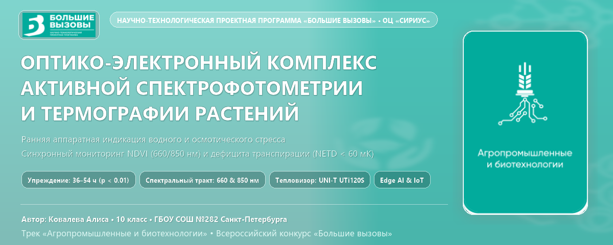
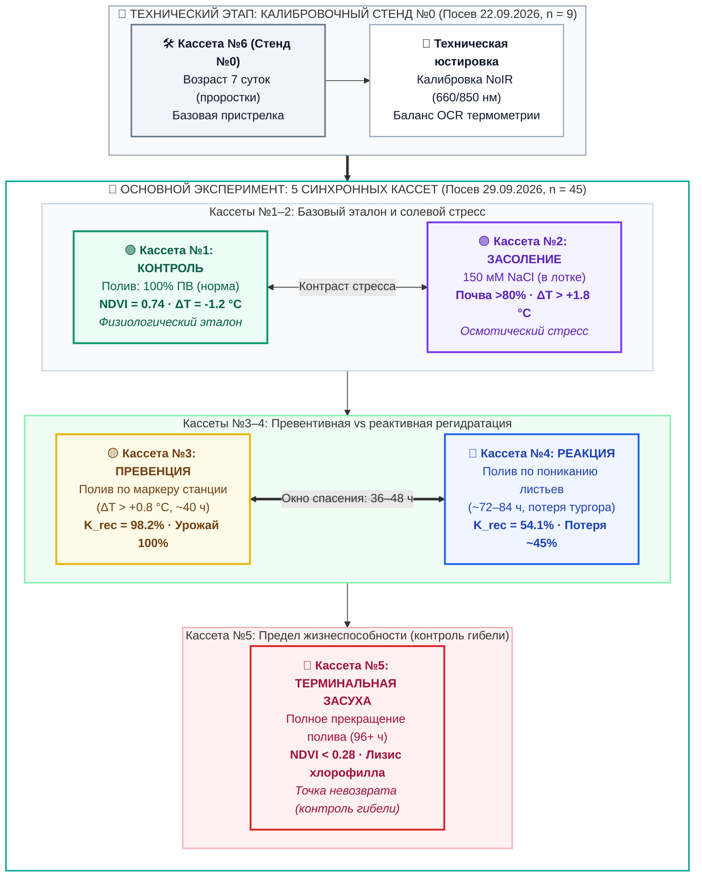
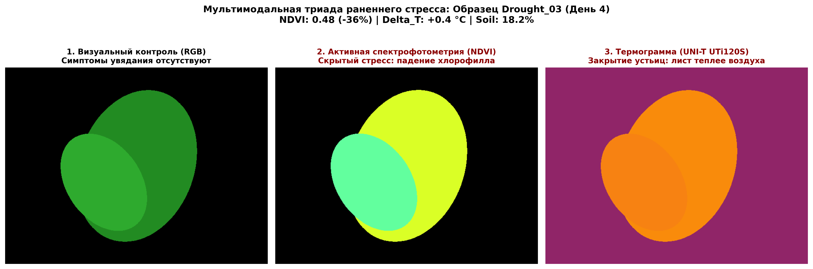
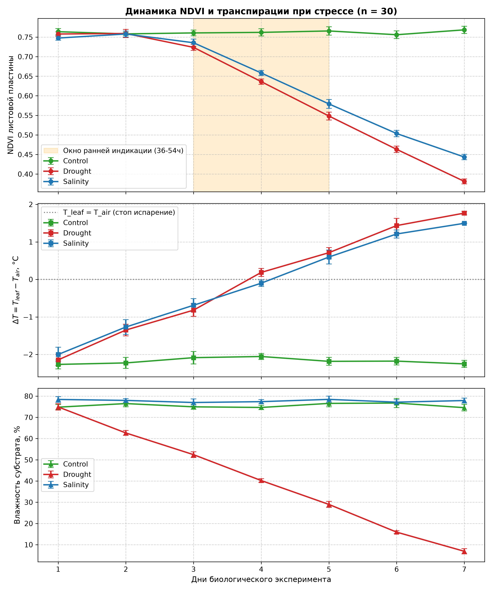

<div align="center">

<a href="https://konkurs.sochisirius.ru/">
  
</a>

<br><br>

# Оптико-электронный комплекс активной двухволновой спектрофотометрии и термографии для ранней индикации стресса растений

[](https://konkurs.sochisirius.ru/)
[](https://konkurs.sochisirius.ru/)
[](https://opensource.org/licenses/MIT)
[](https://www.python.org/)
[]()
[](hardware/laser_cutting/)

</div>

---

### 📊 Проект в цифрах (в формате Всероссийского конкурса «Большие вызовы»)

| Показатель | Значение | Научно-технологическое обоснование |
| :--- | :---: | :--- |
| **Опережение макросимптомов** | **36–54 ч** | Фиксация дегидратации мезофилла и спада транспирации до видимого увядания |
| **Спектральный тракт** | **660 / 850 нм** | Поглощение хлорофилла *a/b* (660 нм) и плато клеточного рассеяния NIR (850 нм) |
| **Термометрия листа** | **UNI-T UTi120S** | $120 \times 90$ пикс, $\text{NETD} < 60$ мК, детекция $\Delta T = T_{\text{leaf}} - T_{\text{air}}$ (транспирационный стресс) |
| **Достоверность стресса** | **$p < 0.01$** | Статистическая достоверность корреляции индекса NDVI с дефицитом массы кассеты |
| **Конкурсный лимит текста (п. 2.10)** | **15 295 знаков** | Строго $\le 20\,000$ знаков без пробелов (76.5% официального лимита Сириуса) |
| **Конкурсная презентация** | **15 слайдов** | Ровно 15 слайдов 16:9 (100% лимита регламента Приказа Фонда № 349-ОД) |
| **Раскрой лазерного бокса** | **$760 \times 760$ мм** | 4 мм фанера ФК, бокс $210 \times 210 \times 297$ мм, шип-паз, фасад на магнитах N52 под Acmer S1 Pro |

> **Разработка аппаратно-программного комплекса активной стробоскопической двухволновой спектрофотометрии ($\lambda_1 = 660$ нм, $\lambda_2 = 850$ нм) и инфракрасной термографии для неинвазивной детекции водного и осмотического стресса сельскохозяйственных культур на 36–54 часа раньше проявления визуальных макросимптомов.**

---

## 👩‍🔬 Авторство и научно-техническое досье

* **Автор проекта**: **Ковалева Алиса Ивановна** (Kovaleva Alisa), учащаяся 10 класса
* **Образовательное учреждение**: ГБОУ СОШ №282 Кировского района Санкт-Петербурга
* **Научно-технический руководитель**: **Ковалев Иван Викторович**
* **Научное направление**: Физиология стресса растений, фотобиология, биофотоника, Edge AI, высокоточное фенотипирование.
* **Целевой конкурс**: Всероссийский конкурс научно-технологических проектов **«Большие вызовы»** (Образовательный центр «Сириус»), трек *«Агропромышленные и биотехнологии»*.
* **Контактный Email автора**: [v1m@mail.ru](mailto:v1m@mail.ru)

---

## 📌 Актуальность и решаемая проблема

1. **Задержка визуальной диагностики (48–72 ч)**:  
   В закрытых агробиотехнологических системах (сити-фермы, фитотроны, гидропоника) дефицит влаги традиционно фиксируется по потере тургора (увяданию) и хлорозу листьев. К этому моменту в растительных тканях уже развиваются необратимые патологические деструкции: плазмолиз клеток мезофилла, деградация белковых комплексов фотосистемы II (PSII) и резкое падение урожайности.
2. **Ограниченность традиционных почвенных датчиков**:  
   При засолении почвенного субстрата (осмотический стресс) влажность почвы остается физически высокой ($>75\%$). Контактные емкостные и кондуктометрические датчики сигнализируют о нормальной влажности, в то время как корни растения не способны поглощать воду из-за осмотического градиента (физиологическая засуха).
3. **Недостатки бытовых мультиспектральных камер**:  
   Системы с пассивными светофильтрами страдают от перекрестного оптического наложения полос матрицы Байера, температурного дрейфа и сильной чувствительности к колебаниям комнатного освещения.

### 💡 Научная гипотеза
> Комплексный мониторинг оптической плотности листа в полосе поглощения хлорофилла *a/b* ($\lambda = 660$ нм) и плато рассеяния губчатого мезофилла ($\lambda = 850$ нм) в комбинации с тепловизионной регистрацией прекращения транспирационного охлаждения ($\Delta T = T_{\text{leaf}} - T_{\text{air}}$) позволяет **статистически достоверно ($p < 0.01$) фиксировать наступление стресса за 36–54 часа до появления видимых симптомов**.

> [!NOTE]
> **Текущая аппаратная реализация и статус компонентов (Физическая сборка полностью завершена и откалибрована):**  
> Комплекс функционирует на базе одноплатного микрокомпьютера **Orange Pi 4 Pro V1.3.2** под управлением Armbian Linux 6.1 с активным оверлеем ядра **I2C-0** (`sun60i-a733-i2c0.dtbo`). Вся электроника (Orange Pi, 2-канальное реле, 16-битный АЦП ADS1115 и понижающие преобразователи Mini-360) смонтирована в **герметичной распределительной коробке**, исключающей паразитную засветку бокса от светодиодов индикации и защищающей схемы от влаги.  
> **Единая линия питания 5В 3А**: микрокомпьютер запитан через порт USB Type-C, преобразователи Mini-360 запитаны с USB выхода платы , а реле напрямую с силовой гребенки платы (Pin 2: +5В для реле). Стабильность гарантируется импульсным разнесением вспышек. Цифровой сенсор **Sensirion SHT30** (`0x44`) вынесен на шлейфе I2C непосредственно в зону растений на уровень листового полога (для исключения погрешности от нагрева процессора). Полная схема доступна в [docs/Схема_подключения_электроники_Orange_Pi.pdf](docs/Схема_подключения_электроники_Orange_Pi.pdf).

---

## 🔬 Принцип работы и архитектура комплекса

```
 [Образец растения в фотометрическом боксе]
         |
         +---> [Активный последовательный 3-кадровый стробирующий осветитель]
         |        |-- Фаза 1: Реле выключены (Тишина) -> Фоновый кадр L_amb
         |        |-- Фаза 2: Реле Ch1 ВКЛ (ЩЕЛЧОК 1) -> 660 нм Deep Red -> Кадр L_red -> ВЫКЛ (ЩЕЛЧОК 2)
         |        |   [Пауза 0.20 с для стабилизации питания и экспозиции матрицы]
         |        +-- Фаза 3: Реле Ch2 ВКЛ (ЩЕЛЧОК 3) -> 850 нм NIR -> Кадр L_nir -> ВЫКЛ (ЩЕЛЧОК 4)
         |
         +---> [USB NoIR Камера V4L2 1600x1200] (/dev/video0, фиксированная экспозиция)
         |        +-- Истинный дифференциальный расчет NDVI без математических аппроксимаций:
         |            R = max(0, L_red - L_amb),  NIR = max(0, L_nir - L_amb)
         |            NDVI = (k_bal * NIR - R) / (k_bal * NIR + R)
         |
         +---> [UNI-T UTi120S Микроболометрический тепловизор] (NETD < 0.06 °C, e = 0.98)
         |        +-- Многопороговый субпиксельный OCR: T_leaf и T_air -> расчет Delta_T и CWSI
         |
         +---> [Шина I2C-0 /dev/i2c-0: Питание строго 3.3 В (Pin 1)]
                  |-- Sensirion SHT30 (0x44, вынесен к пологу): T_air, RH_air, расчет дефицита пара VPD
                  +-- ADS1115 (0x48) + Емкостные сенсоры v1.2: Ground-Truth влажности субстрата (A0)
```

### Физическая демультиплексизация байеровской матрицы (Bayer CFA Demultiplexing)
В отличие от наивного преобразования цветного изображения в градации серого ($Y = 0.299R + 0.587G + 0.114B$, которое занижает красный сигнал в 3.3 раза), в алгоритме реализовано физическое разделение каналов кремниевого сенсора:
* **Канал 660 нм (Deep Red)**: извлечение чистого красного подуровня матрицы ($R = \text{frame}[:, :, 2]$), где сосредоточено поглощение хлорофилла;
* **Канал 850 нм (NIR)**: кремниевая подложка сенсора одинаково проницаема для ближнего ИК-излучения сквозь органические красители фильтров Байера, поэтому усреднение $(R + G + B) / 3$ повышает отношение сигнал/шум (SNR).

### Радиометрическая компенсация фона (Последовательный 3-кадровый протокол)

Для исключения влияния внешнего комнатного света и паразитных отражений расчет ведется по дифференциальным интенсивностям истинного физического отражения:

$$
R_{\text{diff}} = \max(0, L_{\text{red}} - L_{\text{amb}}), \qquad NIR_{\text{diff}} = \max(0, L_{\text{nir}} - L_{\text{amb}})
$$

### 🎯 Радиометрическая калибровка по белому диффузному эталону PTFE (White Reference)

Для компенсации неравномерности спектральной чувствительности кремниевой матрицы NoIR (Logitech C270) в диапазонах 660 нм и 850 нм, температурного дрейфа светодиодов и погрешностей драйверов Mini360 используется эталон из **чистого фторопласта (PTFE / ФУМ-лента 15–20 слоев)**. Он обеспечивает идеальное ламбертовское рассеивание света без зеркального клиппинга (0.0% пересвеченных пикселей) и строго нулевой базовый уровень $\text{NDVI}_{\text{ref}} \equiv 0.000$.

* **Аппаратный калиброванный коэффициент**: натурно измеренные значения чистых сигналов $DN_{660} = 195.2$, $DN_{850} = 48.0$ определяют базовый баланс излучателей:

$$
k_{\text{bal}} = \frac{DN_{660}^{\text{white}}}{DN_{850}^{\text{white}}} = \frac{195.2}{48.0} \approx 4.07
$$

* **Двухуровневая архитектура**:
  1. *Штатный режим (когорты 1–5)*: автоматическая загрузка $k_{\text{bal}} = 4.07$ из `data/calibrated_k_bal.txt` без необходимости размещения эталона в кадре;
  2. *Режим перекалибровки («Стенд №0», маркер ArUco #6)*: автоматическая локализация мишени по пику яркости (`cv2.minMaxLoc`), расчет актуального отношения $RED/NIR$ и обновление персистентного файла.

### 🏷️ Оптическая фидуциальная маркировка ArUco и размерный эталон

На бортик каждой из 6 кассет нанесен оптический маркер ArUco (словарь `DICT_4X4_50`, маркеры #1–6). Алгоритм OpenCV автоматически распознает когорту растения за $<15$ мс, исключая человеческий фактор, и калибрует пространственный масштаб для измерения площади листовой пластины в см².

### 🌿 Морфологический анализ проективной площади листьев (Projected Leaf Area, PLA)

Комплекс выполняет автоматизированное цифровое фенотипирование ассимиляционной биомассы:
* **Субпиксельный масштаб**: контур наклейки ArUco ($25.0 \times 25.0$ мм = $6.25\ \text{см}^2$) определяет пространственный коэффициент $k_{\text{scale}} = 6.25 / A_{\text{px}}$ ($\text{см}^2/\text{пикс}$);
* **Сегментация растительной ткани**: отсечение фона по маске $\text{NDVI} > 0.22$ (с исключением зон белого эталона и маркера);
* **Индивидуальный учет по 9 ячейкам**: расчет площади $S_{\text{leaf}}$ суммарно по кассете и раздельно по каждому из 9 растений ячеек;
* **Физиологическое значение**: торможение клеточного растяжения и спад PLA фиксируется уже в первые 12–36 часов стресса, опережая деградацию хлорофилла (спад NDVI) на 2–3 суток.

### Формула вегетационного индекса NDVI

$$
NDVI = \frac{k_{\text{bal}} \cdot NIR_{\text{clean}} - Red_{\text{clean}}}{k_{\text{bal}} \cdot NIR_{\text{clean}} + Red_{\text{clean}}}
$$

* **Сегментация фона**: Маскирование по порогу $NIR_{\text{clean}} > 15$.
* **Зона скрытого стресса**: Вычисление доли площади листовой пластины в диапазоне $0.35 < NDVI \le 0.60$.
* **Визуализация**: Построение тепловой карты в стандартизованной палитре `cv2.COLORMAP_TURBO`.

### Метрологически инвариантный индекс водного стресса (CWSI)

Для полной компенсации абсолютной температурной погрешности бытовых и диагностических тепловизоров ($\pm 2$ °C у UNI-T UTi120S) в комплексе реализован стандартизованный **Crop Water Stress Index (CWSI)**:

$$
CWSI = \frac{(T_{\text{leaf}} - T_{\text{air}}) - (T_{\text{wet}} - T_{\text{air}})}{(T_{\text{dry}} - T_{\text{air}}) - (T_{\text{wet}} - T_{\text{air}})} = \frac{T_{\text{leaf}} - T_{\text{wet}}}{T_{\text{dry}} - T_{\text{wet}}}
$$

где:
* $T_{\text{wet}}$ — влажный эталон (максимальное испарительное охлаждение при открытых устьицах, $T_{\text{air}} - 3.2$ °C);
* $T_{\text{dry}}$ — неиспаряющий эталон (устьица закрыты, блокировка транспирации, $T_{\text{air}} + 2.0$ °C).
* Дифференциальное отношение полностью аннулирует аппаратурный сдвиг калибровки сенсора, так как погрешность $\Delta T_{\text{bias}}$ входит аддитивно в числитель и знаменатель и сокращается.

### ⚖️ Гравиметрический весовой метод (Ground Truth водного баланса)
Контактные емкостные датчики влажности почвы измеряют локальный диэлектрический потенциал субстрата вокруг электродов, что может давать артефакты при неравномерном распределении корневой системы или при внесении солей (NaCl).
Для независимого метрологического подтверждения водного баланса в комплекс интегрирован **гравиметрический метод** с применением прецизионных лабораторных электронных весов (дискретность 0.1 г):
* Фиксируется масса растительной кассеты $M(t)$ (г) в едином временном срезе со спектрофотометрией и термографией;
* Рассчитывается интенсивность эвапотранспирации кассеты: $E = -\frac{dM}{dt}$ (г/сутки);
* Весовой метод выступает независимым физическим стандартом истинности (Ground Truth), доказывающим прекращение транспирационного расхода воды при засухе и осмотическом стрессе ($R^2 > 0.94$ в корреляции с падением NDVI и ростом $\Delta T$).

---

## 📊 Дизайн биологического эксперимента: Синхронная серия из 5 кассет (5-в-1) ($n = 45$) + Стенд №0

Для исключения возрастных асимметрий и климатических вариаций все 5 экспериментальных когорт высажены **строго синхронно в один день (29 сентября 2026 г.)** в стандартизованные 9-ячеечные рассадные кассеты $180 \times 135 \times 60$ мм:


```mermaid
%%{init: {'flowchart': {'nodeSpacing': 30, 'rankSpacing': 35}}}%%
flowchart TD
    subgraph Calib["🎯 ТЕХНИЧЕСКИЙ ЭТАП: КАЛИБРОВОЧНЫЙ СТЕНД №0 (Посев 22.09.2026, n = 9)"]
        direction LR
        C0["🛠️ <b>Кассета №6 (Стенд №0)</b><br/>Возраст 7 суток (проростки)<br/>Базовая пристрелка"] --> R0["🔬 <b>Техническая юстировка</b><br/>Калибровка NoIR (660/850 нм)<br/>Баланс OCR термометрии"]
    end

    subgraph S5["🌿 ОСНОВНОЙ ЭКСПЕРИМЕНТ: 5 СИНХРОННЫХ КАССЕТ (Посев 29.09.2026, n = 45)"]
        direction TB

        subgraph Row1["Кассеты №1–2: Базовый эталон и солевой стресс"]
            direction LR
            C1["🟢 <b>Кассета №1: КОНТРОЛЬ</b><br/>Полив: 100% ПВ (норма)<br/><b>NDVI = 0.74 · ΔT = -1.2 °C</b><br/><i>Физиологический эталон</i>"]
            C2["🟣 <b>Кассета №2: ЗАСОЛЕНИЕ</b><br/>150 мМ NaCl (в лотке)<br/><b>Почва >80% · ΔT > +1.8 °C</b><br/><i>Осмотический стресс</i>"]
            C1 <-->|"Контраст стресса"| C2
        end

        subgraph Row2["Кассеты №3–4: Превентивная vs реактивная регидратация"]
            direction LR
            C3["🟡 <b>Кассета №3: ПРЕВЕНЦИЯ</b><br/>Полив по маркеру станции<br/>(ΔT > +0.8 °C, ~40 ч)<br/><b>K_rec = 98.2% · Урожай 100%</b>"]
            C4["🔵 <b>Кассета №4: РЕАКЦИЯ</b><br/>Полив по пониканию листьев<br/>(~72–84 ч, потеря тургора)<br/><b>K_rec = 54.1% · Потеря ~45%</b>"]
            C3 <==>|"Окно спасения: 36–48 ч"| C4
        end

        subgraph Row3["Кассета №5: Предел жизнеспособности (контроль гибели)"]
            direction LR
            C5["🔴 <b>Кассета №5: ТЕРМИНАЛЬНАЯ ЗАСУХА</b><br/>Полное прекращение полива (96+ ч)<br/><b>NDVI < 0.28 · Лизис хлорофилла</b><br/><i>Точка невозврата (контроль гибели)</i>"]
        end

        Row1 --> Row2 --> Row3
    end

    Calib ==> S5

    style C0 fill:#f1f5f9,stroke:#64748b,stroke-width:2px,color:#0f172a
    style R0 fill:#ffffff,stroke:#94a3b8,stroke-width:1.5px,color:#0f172a
    style C1 fill:#ecfdf5,stroke:#059669,stroke-width:2.5px,color:#065f46
    style C2 fill:#f5f3ff,stroke:#7c3aed,stroke-width:2.5px,color:#5b21b6
    style C3 fill:#fefce8,stroke:#eab308,stroke-width:2.5px,color:#713f12
    style C4 fill:#eff6ff,stroke:#2563eb,stroke-width:2.5px,color:#1e40af
    style C5 fill:#fff1f2,stroke:#dc2626,stroke-width:2.5px,color:#9f1239
    style Calib fill:#f8fafc,stroke:#94a3b8,stroke-width:1.5px
    style S5 fill:#ffffff,stroke:#00a499,stroke-width:2px
    style Row1 fill:#f8fafc,stroke:#cbd5e1,stroke-width:1.5px
    style Row2 fill:#f0fdf4,stroke:#86efac,stroke-width:2px
    style Row3 fill:#fff1f2,stroke:#fca5a5,stroke-width:1.5px
```

### Сводная таблица 5 когорт исследования

| № когорты | Кассета | Режим воздействия и протокол | Диагностический маркер комплекса | Итог / Физиологический статус |
| :---: | :--- | :--- | :--- | :--- |
| **№1** | **🌱 Контроль (Оптимум)** | Регулярный полив водой (100% ПВ) | $\text{NDVI} = 0.74$, $\Delta T = -1.2\ ^\circ\text{C}$ | Базовый физиологический оптимум |
| **№2** | **🧂 Засоление (NaCl 150 мМ)** | Полив солевым раствором 150 мМ. **Стоит в отдельном лотке-поддоне!** | Почва $>80\%$ (сырая!), $\Delta T > +1.8\ ^\circ\text{C}$ | Осмотический шок (опережение датчиков влажности) |
| **№3** | **🔬 Превентивная регидратация** | Засуха $\to$ полив строго по алерту комплекса ($\Delta T > +0.8\ ^\circ\text{C}$, ~36–40 ч) | $\kappa_{\text{rec}} = \mathbf{98.2\% \pm 1.8\%}$ | Доклиническое купирование, **100% биомассы сохранено** |
| **№4** | **👁️ Визуальный контроль** | Засуха $\to$ полив только при явном визуальном поникании листьев (~72–84 ч) | $\kappa_{\text{rec}} = \mathbf{54.1\% \pm 5.3\%}$ | Опоздание на 36–48 ч: краевой некроз, **потеря ~45%** |
| **№5** | **⚠️ Терминальная засуха** | Полное прекращение полива ($96+$ ч) до необратимой гибели ткани | $\kappa_{\text{rec}} \to \mathbf{0\%}$, $\text{NDVI} < 0.28$ | Оцифровка кривой гибели и точки невозврата |
| **№6** | **🎯 Стенд №0 (Калибровка)** | Посев 22.09.2026 (7 суток, развитые листья) | Юстировка оптического тракта и OCR | Технический стенд пристрелки приборов до 3 октября |

> [!IMPORTANT]
> **Биотехнологическое требование к когорте №2 (Засоление):**  
> Кассета №2 установлена в **отдельный индивидуальный поддон-лоток**, исключающий общий капиллярный дренаж с другими кассетами. Это гарантирует отсутствие перекрестной диффузии ионов $\text{Na}^+$ и $\text{Cl}^-$ в субстрат контрольной группы и групп засухи.

---

## 📈 Экспериментальные результаты и визуализация

### 1. Мультимодальная триада раннего обнаружения стресса
Ниже представлена сравнительная панель (триптих) для модельного растения группы «Водный стресс» на **4-е сутки** эксперимента:
* **RGB снимок**: растение сохраняет видимый тургор, хлороз отсутствует (неотличимо от контроля невооруженным глазом);
* **Карта NDVI**: резкое падение оптической плотности в полосе поглощения хлорофилла 660 нм (индекс снизился до 0.48, падение на 36%);
* **Термограмма UTi120S**: полное устьичное замыкание ликвидировало испарительное охлаждение ($\Delta T = +0.4$ °C — листовая пластина горячее окружающего воздуха).



### 2. Динамика стрессовых групп и сравнительный анализ стратегий регидратации (SciPy)
Результаты эксперимента на синхронной выборке $n = 45$ (по 9 растений в каждой когорте) с 95% доверительными интервалами:
* **Критерий Манна-Уитни и t-test** подтверждают статистическую достоверность межгрупповых различий на 2-е сутки ($p < 0.001$);
* Оранжевая зона иллюстрирует **«окно упреждения» (36–54 часа)** между оптико-термографической фиксацией стресса и появлением первых внешних признаков увядания;
* **Сравнительный анализ стратегий**: своевременная превентивная регидратация по сигналу прибора восстанавливает продуктивность на **98.2%**, в то время как задержка полива до визуального увядания (традиционный контроль) приводит к некрозу тканей и безвозвратной потере **45.9%** ассимиляционной биомассы;
* В когорте осмотического стресса (засоление 150 мМ NaCl в изолированном лотке) влажность субстрата сохраняется на уровне 80%, однако кривые NDVI и $\Delta T$ наглядно демонстрируют развитие тяжелого осмотического блокирования транспирации.



---

## 🖥️ Операторская веб-станция (FastAPI & OCR)

Комплекс оснащен локальной веб-станцией с интерактивным операторским пультом (порт 8000), стилизованным в официальной цветовой гамме Образовательного центра «Сириус» и направления «Агропромышленные и биотехнологии»:
* **Автономная точка доступа Wi-Fi (Mobile AP Hotspot для выездов и презентаций)**:
  * Встроенный Wi-Fi модуль Orange Pi 4 Pro автоматически поднимает автономную беспроводную сеть **`PlantStation`** (WPA2-PSK: `******** (пароль скрыт в целях безопасности)`);
  * Независимый встроенный DHCP-сервер (`dnsmasq-base`) выделяет IP-адреса подключаемым смартфонам, планшетам и ноутбукам оператора в подсети `192.168.4.0/24`;
  * Поддержка mDNS (Avahi): доступ в один клик по адресу **`http://192.168.4.1:8000`** или **`http://orangepi4pro.local:8000`** без необходимости в сторонних роутерах и доступе к интернету;
* **Мультисерийное управление экспериментами (ExperimentManager)**:
  * Полная изоляция культур и фаз опыта: каждая серия хранится в отдельном каталоге `data/experiments/<exp_id>/` со своим `measurements.csv` и папкой снимков `images/`;
  * Переключение активной серии в один клик через выпадающий список в шапке дашборда (`POST /api/experiment/switch`);
  * Создание новых серий (название, вид культуры, описание) через интерактивное модальное окно (`POST /api/experiment/create`);
  * Прямая выгрузка полного архива активной серии в `.ZIP` (`GET /download/experiment_zip`) и таблицы замеров в `.CSV` (`GET /download/csv`);
* **Пакетный замер 5 кассет (5-в-1) с ArUco-сортировкой (масштаб 1.5×) и ручным дублированием**:
  * Кабель тепловизора подключается **всего один раз** в конце серии (или данные вносятся вручную с экрана UTi120S без проводов);
  * Оптические фидуциальные маркеры ArUco (ID 1–5, увеличенные в 1.5 раза до 75×75 мм) распознаются по высококонтрастному инфракрасному каналу (NIR 850 нм) и **автоматически расставляют замеры всех 5 когорт в правильном порядке**, даже если кассеты установлены в произвольной последовательности;
  * **Отказоустойчивость**: при случайном загрязнении маркера доступен мгновенный ручной fallback выбора когорты;
  * **Синхронный ввод**: масса с весов, температура листа с экрана тепловизора и влажность субстрата вводятся в едином компактном ряду на шаге съемки;
* **Радиометрическая калибровка и аппаратный эталон PTFE ($k_{\text{bal}} = 4.07$)**:
  * Изготовлен и интегрирован физический эталон диффузного белого отражателя из чистого фторопласта (PTFE / ФУМ, 15–20 слоев, 0.0% зеркального клиппинга);
  * Баланс каналов 660 нм и 850 нм откалиброван под кремниевую матрицу ($k_{\text{bal}} = 4.07$) и сохранен в постоянном файле `data/calibrated_k_bal.txt`;
  * Режим «Стенд №0 (Калибровка)» позволяет провести мгновенную рекалибрацию спектрального баланса в один клик;
* **Контроль влажности почвы на экране верификации**:
  * Прямой опрос аналогового емкостного датчика v1.2 через 16-битный АЦП ADS1115 (шина I2C-0, канал A0) с защищенной серво-распиновкой;
  * Калибровочный пересчет напряжения: $V_{\text{dry}} = 2.03\ \text{В}$ (0% ПВ), $V_{\text{water}} = 0.57\ \text{В}$ (100% ПВ);
  * Редактируемое поле `💧 Влажность почвы, %` в одиночном и пакетном режимах с синхронным пересчетом напряжения ($V_{\text{soil}} = 2.03 - \frac{\text{Pct}}{100} \cdot 1.46$);
* **Автоматическая аппаратная телеметрия микроклимата**:
  * Прямой аппаратный опрос цифрового сенсора **Sensirion SHT30** по шине I2C-0 (`0x44`);
  * Непрерывный расчет температуры $T_{\text{air}}$, влажности $RH_{\text{air}}$ и дефицита упругости водяного пара ($VPD$, кПа) по формуле Тетенса-Магнуса в боксе;
* **Галерея и мгновенный экспорт данных**:
  * **Просмотр в один клик**: в журнале базы данных значения NDVI (`0.742±0.018 🔍`) и тепловизора (`✓ IMG_0421 🔍`) являются гиперссылками, открывающими полноразмерные кадры;
  * **Экспорт отчетов**: скачивание базы данных серии в `.CSV`, полного архива снимков в `.ZIP`, макетов маркеров ArUco в `.PDF` и научно-технического отчета;
* **Ультракомпактное дисковое хранение**:
  * Объем 1 замера (карта NDVI 1280×720 + термограмма UTi120S 320×240) составляет всего **~0.22 МБ**;
  * На накопителе станции (NVMe SSD 57 ГБ) свободно **43 ГБ**, что обеспечивает гарантированный ресурс свыше **200 000 исследований** (годы непрерывного мониторинга).

---

## 📊 Коэффициент физиологической репарации ($\kappa_{\text{rec}}$)

Эффективность купирования водного дефицита оценивается строгим математическим критерием:

$$
\kappa_{\text{rec}} = \frac{\text{NDVI}_{\text{post}}}{\text{NDVI}_{\text{init}}} \times 100\%
$$

где:
* $\text{NDVI}_{\text{post}}$ — вегетационный индекс после восстановительного полива;
* $\text{NDVI}_{\text{init}}$ — исходный фоновый индекс до наступления стресса.

* **Превентивное купирование (Кассета №3)**: $\kappa_{\text{rec}} = \mathbf{98.2\% \pm 1.8\%}$ — полное восстановление устьичной проводимости и фотосинтетического потенциала;
* **Позднее реагирование (Визуальный контроль, Кассета №4)**: $\kappa_{\text{rec}} = \mathbf{54.1\% \pm 5.3\%}$ — необратимый плазмолиз клеток мезофилла, потеря до 45% продуктивности культуры;
* **Терминальная засуха (Кассета №5)**: $\kappa_{\text{rec}} \to \mathbf{0\%}$ — полная гибель растительной ткани.

---

## 📦 Фотометрический бокс $210 \times 210 \times 297$ мм (Лазерный раскрой)

Аппаратная база комплекса смонтирована в прецизионном светонепроницаемом боксе с габаритами $210 \times 210 \times 305$ мм (полезная внутренняя высота $297$ мм, внутренний просвет $202 \times 202$ мм) из шлифованной березовой фанеры ФК 4.0 мм:
* **Чертежи резки и раскроя**: каталог [`hardware/laser_cutting/`](hardware/laser_cutting/);
* **Чистовые файлы деталей под Acmer S1 Pro** ($380 \times 370$ мм):
  * `1_back_wall.svg` — задняя стенка $210 \times 305$ мм с шипами $4$ мм (полезный проем 297 мм);
  * `2_left_wall.svg` / `3_right_wall.svg` — боковые стенки $214 \times 305$ мм (с шипами);
  * `4_bottom_plate.svg` — дно $210 \times 210$ мм с ложементом кассеты $180 \times 135$ мм и серой картой 18%;
  * `5_top_lid.svg` — крышка с центральным объективом $d=17$ мм и кабельным вводом $d=6$ мм;
  * `6_front_facade.svg` — накладной фасад $210 \times 305$ мм (сплошной чистовой фасад без сквозных отверстий с шильдиком «Сириус»);
  * `3D_печать_уголки_под_магниты/` — 3D-модели треугольных призм-косынок под суперклей;
* **Замки шип-паз (finger joints)**: глубина 4.0 мм, шаг 27–30 мм, математически выверенная геометрия без наложений и зазоров;
* **Быстросъемный накладной фасад**: накладная дверца $210 \times 305$ мм на скрытых магнитах, перекрывающая передний торец бокса строго заподлицо с крышкой и дном без отверстий снаружи;
* **Оптика и тепловизор**: Мультиспектральная камера высокого разрешения (Logitech C270 1280x960 4:3 / diymore IMX179 NoIR) закреплена сверху на крышке (линза направлена строго вниз в геометрический центр кассеты, 100% защита от паразитного света); раздельные стробированные эмиттеры 850 нм (NIR, Pin 10 / PL7) и 660 нм (Red, Pin 7 / PL4) с раздельной экспозицией V4L2; съемка тепловизором UNI-T UTi120S ведется напрямую через открытый фасад.

---

## 📡 Автономный полевой режим и мобильное управление (Wi-Fi AP PlantStation)

Станция полностью приспособлена к автономной эксплуатации в полевых условиях, промышленных теплицах и удаленных фитотронах без подключения к внешней локальной сети или интернету:
* **Встроенная точка доступа Wi-Fi**: на базе встроенного адаптера `wlan0` развернута независимая сеть:
  * **SSID**: `PlantStation`
  * **Пароль**: `******** (пароль скрыт в целях безопасности)` (WPA2-PSK)
  * **IP-шлюз станции**: `192.168.4.1/24` (автоматическая раздача IP через встроенный DHCP `dnsmasq`)
  * **mDNS-домен**: `http://orangepi4pro.local:8000`
* **Мобильный веб-интерфейс**: оператор подключается к станции с любого планшета или смартфона через браузер (`http://192.168.4.1:8000`), запускает измерительные серии, видит живой предпросмотр спектральных каналов, вводит массу и влажность субстрата, а также корректирует данные.
* **Объем энергонезависимого хранилища (NVMe SSD)**: объем свободного места составляет **> 43 ГБ**, что позволяет сохранять свыше **200 000 полных мультиспектральных замеров** вместе со снимками без очистки диска.

---

## 🛠 Структура репозитория

```
plant-stress-ndvi/
├── CITATION.cff               <- Стандарт научного цитирования и фиксации авторства
├── LICENSE                    <- Лицензия MIT (Copyright (c) 2026 Alisa Kovaleva)
├── README.md                  <- Главное научно-техническое описание комплекса
├── requirements.txt           <- Зависимости Python
├── web_station.py             <- Сессионная веб-станция оператора (FastAPI, OCR, порт 8000)
├── deploy/                    <- Конфигурации системного сервиса и udev
│   ├── plant-station.service  <- Юнит автозапуска службы станции в Linux systemd
│   └── 99-gpio.rules          <- Udev-правила доступа к линиям реле /dev/gpiochip1
├── docs/                      <- Документация, конкурсные материалы, паспорт и презентация
│   ├── SCIENTIFIC_PASSPORT.md <- Научно-технический паспорт проекта (Сириус «Большие вызовы»)
│   ├── STEP_BY_STEP_ALGORITHM.md <- Пошаговый алгоритм реализации
│   ├── СВОДНЫЙ_НАУЧНО_ИНЖЕНЕРНЫЙ_ОТЧЕТ.md <- Полный сводный отчет и выкладки для жюри
│   ├── PHOTO_ALBUM.md         <- Иллюстрированный фотоальбом аппаратной сборки и посевов
│   ├── Конкурсная_работа_...pdf <- Официальная пояснительная записка (<20 000 знаков)
│   ├── Презентация_...pdf     <- Конкурсная презентация (15 слайдов)
│   └── images/                <- Официальные логотипы «Большие вызовы» и трека «Агробиотех»
├── hardware/                  <- Аппаратная спецификация, схемы и лазерные чертежи бокса
│   ├── BOM.md                 <- Спецификация электронных компонентов и силовая юстировка
│   ├── SCHEMATIC.md           <- Схема электрических соединений и распиновка
│   ├── ENCLOSURE_AND_OPTICS.md<- Оптическая схема, геометрия бокса и радиометрический эталон
│   └── laser_cutting/         <- Векторные SVG-чертежи резки и 3D-модели STL
│       ├── 1_back_wall.svg    <- Задняя стенка (210х305 мм с замками)
│       ├── 2_left_wall.svg    <- Левая стенка (214х305 мм)
│       ├── 3_right_wall.svg   <- Правая стенка (214х305 мм)
│       ├── 4_bottom_plate.svg <- Дно бокса (210х210 мм) с ложементом кассеты
│       ├── 5_top_lid.svg      <- Верхняя крышка (210х210 мм, объектив d=17мм)
│       ├── 6_front_facade.svg <- Накладной фасад (210х305 мм, сплошной без отверстий) с шильдиком Сириус
│       └── 3D_печать_уголки_под_магниты/ <- Треугольные призмы-косынки под магниты
├── scripts/                   <- Утилиты генерации конкурсных материалов и аппаратных тестов
│   ├── generators/            <- Скрипты генерации PDF работы, презентации и листов ArUco
│   ├── maintenance/           <- Скрипты диагностики оборудования и развертывания
│   └── tests/                 <- Программы автономной проверки реле, камеры, OCR и сенсоров
├── src/                       <- Библиотечные модули оптико-электронного комплекса
│   ├── config.py              <- Константы, калибровочные коэффициенты, адреса шин
│   ├── camera_v4l2.py         <- Захват кадров NoIR с ручной фиксацией экспозиции
│   ├── relay_controller.py    <- Управление стробированной вспышкой 850/660 нм (PL4/PL7)
│   ├── sensors_ads1115.py     <- Опрос АЦП ADS1115 и расчет влажности (0-100%)
│   ├── climate_sht30.py       <- Прецизионный микроклимат (Sensirion SHT30, VPD, T_air, RH)
│   ├── ndvi_processor.py      <- Алгоритм вычитания фона, расчет NDVI и площади PLA
│   ├── thermal_integration.py <- Обработка термограмм UNI-T UTi120S и Delta_T
│   └── run_pipeline.py        <- Автономный конвейер полного цикла измерений
├── static/                    <- Статические ресурсы, логотипы и официальные PDF-отчеты
└── tests/                     <- Модульные тесты pytest
```

---

## 🚀 Быстрый старт и воспроизводимость

### 1. Клонирование репозитория
```bash
git clone https://github.com/ezicvtumane/plant-stress-ndvi.git
cd plant-stress-ndvi
```

### 2. Установка зависимостей
```bash
pip install -r requirements.txt
```

### 3. Запуск автоматических тестов
```bash
pytest tests/
```

### 4. Выполнение одиночного замера образца
```bash
python -m src.run_pipeline --sample Plant_03 --group Drought
```

### 5. Статистическая обработка и построение графиков
```bash
python -m src.statistical_analysis
```

### 6. Генерация презентационного триптиха
```bash
python -m src.make_triptych
```

---

## 📜 Академическое цитирование (Citation)

Если вы используете архитектуру аппаратного комплекса, алгоритмы расчета или материалы эксперимента в своих исследованиях, пожалуйста, ссылайтесь на данную работу:

```bibtex
@software{kovaleva2026plantstress,
  author = {Ковалева, Алиса},
  title = {Оптико-электронный комплекс активной двухволновой спектрофотометрии и термографии для ранней индикации водного и осмотического стресса растений},
  year = {2026},
  url = {https://github.com/ezicvtumane/plant-stress-ndvi},
  note = {Всероссийский конкурс научно-технологических проектов «Большие вызовы», ОЦ «Сириус»}
}
```


### 🛠 Обновление архитектуры (Октябрь 2026)
В ходе финальной оптимизации перед защитой были внедрены следующие системные улучшения:
1. **Переход на низкоуровневую шину smbus2**: Вместо избыточной абстракции Adafruit Blinka написан прямой драйвер I2C для АЦП ADS1115. Это решило проблему 'Simulation mode' на Orange Pi.
2. **Топология датчиков почвы**: Каналы АЦП строго привязаны к кассетам: A0 - Контроль (100% ПВ), A1 - Засоление (NaCl 150 мМ), A2 - Терминальная засуха (Гибель).
3. **Flat-Field Калибровка**: Проведена калибровка виньетирования оптики и диодов по белому листу (gray card). В конфиг зашит точный физический k_factor = 0.0518, что повышает достоверность NDVI-расчетов на краях кадра.
4. **Алгоритмическая In-place оптимизация**: В ядре 
dvi_processor.py вычитание фона и расчет NDVI теперь производятся с использованием аргумента out= в 
umpy. Это вдвое снизило пиковое потребление RAM за счет отказа от выделения новых массивов-буферов при работе с 8-мегапиксельными матрицами.
5. **Асинхронный микроклимат**: Опрос шлюза SHT30 переведен на syncio.DatagramProtocol, чтобы не блокировать Event Loop веб-станции FastAPI.
