# 📸 ФОТОАЛЬБОМ НАУЧНО-ИССЛЕДОВАТЕЛЬСКОГО ПРОЕКТА
### Фотодокументация этапов разработки, аппаратной сборки, 3D-печати и биологического эксперимента

**Проект**: Оптико-электронный комплекс активной двухволновой спектрофотометрии и термографии для ранней индикации водного и осмотического стресса растений  
**Автор**: Ковалева Алиса Ивановна, 10 класс  
**Руководитель**: Ковалев Иван Викторович  
**База**: Лаборатория биофотоники и закрытого растениеводства, Санкт-Петербург, 2026 г.  
**Целевой конкурс**: Всероссийский конкурс научно-технологических проектов «Большие вызовы» (ОЦ «Сириус»)

---

## Раздел 1. Аддитивное производство (3D-печать) и модульный корпус электроники

Для компактного, виброустойчивого и безопасного размещения управляющих плат, сенсоров и силовой коммутации разработан и напечатан двухсекционный модульный корпус на 3D-принтере.

| Печать корпуса на 3D-принтере Creality | Смонтированный блок электроники с охлаждением |
| :---: | :---: |
| 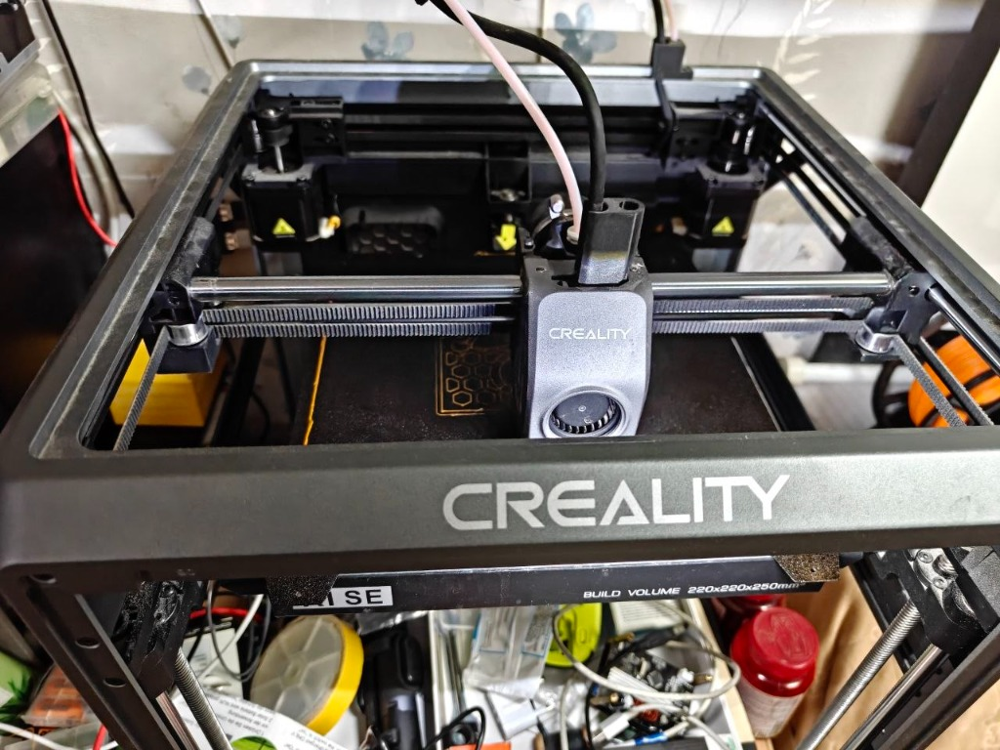 | 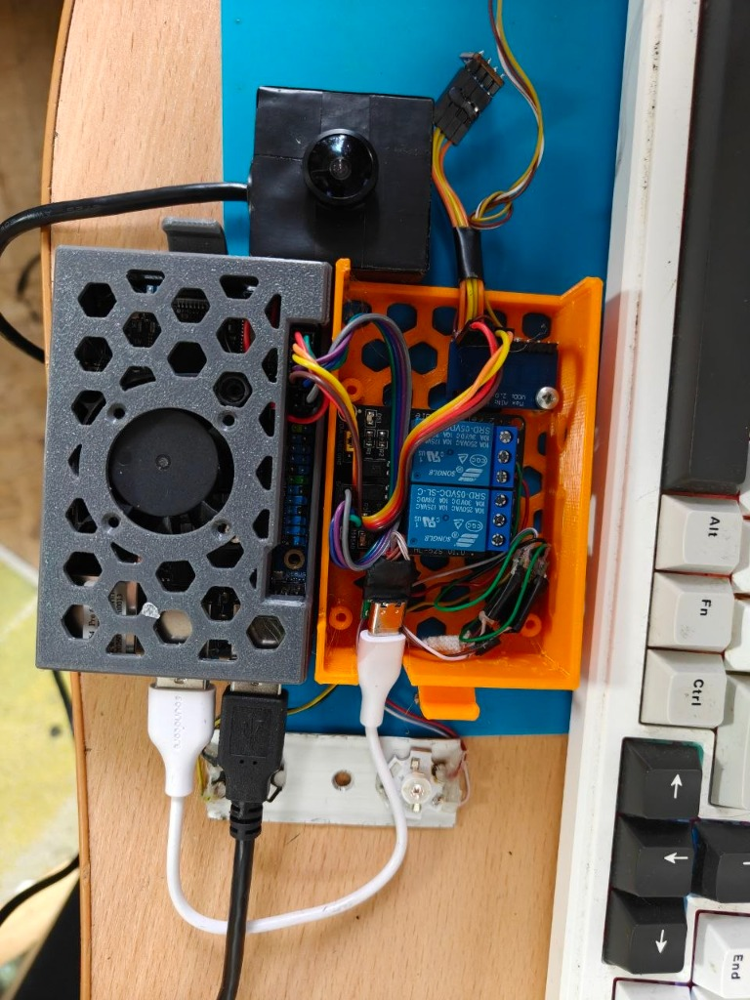 |
| **Рис. 1.1.** Процесс печати сотовой вентиляционной решетки и модульного шасси на 3D-принтере Creality (поле $220 \times 220 \times 250$ мм). | **Рис. 1.2.** Аппаратный модуль в сборе: серый отсек Orange Pi 4 Pro с кулером + оранжевый силовой отсек с 2-канальным реле, АЦП ADS1115, стабилизаторами Mini-360, камерой IMX179 и шлейфом SHT30. |

### Особенности конструкции модульного блока:
1. **Секция вычислителя (серый корпус)**:
   * Сотовая вентиляционная сетка (hexagonal mesh) для эффективной естественной и принудительной конвекции;
   * Интегрированный осевой вентилятор активного охлаждения процессора Allwinner;
   * Вывод портов USB (для NoIR-камеры и кабелей) и разъема питания USB Type-C.
2. **Силовая коммутационная секция (оранжевый корпус)**:
   * 2-канальное электромеханическое реле 5 В (Songle SRD-05VDC-SL-C) с оптической развязкой;
   * 16-битный прецизионный АЦП ADS1115 для аналоговых датчиков влажности субстрата;
   * Два понижающих стабилизатора Mini-360 с независимой регулировкой напряжения для 660 нм (2.20 В) и 850 нм (1.60 В);
   * Входной клеммный узел питания 5 В с фильтрующими конденсаторами;
   * Кронштейн крепления мультиспектральной камеры diymore IMX179 NoIR (черный кожух с объективом M12).
3. **Шлейфы подключения**:
   * Экранированный 4-проводный гибкий шлейф I2C для выноса датчика микроклимата Sensirion SHT30 непосредственно к пологу растений;
   * Разъем подключения емкостных датчиков влажности почвы v1.2.

---

## Раздел 2. Аппаратная сборка, пайка и метрологическая юстировка

Личное изготовление аппаратной части автором проекта (Ковалева Алиса, 10 класс):

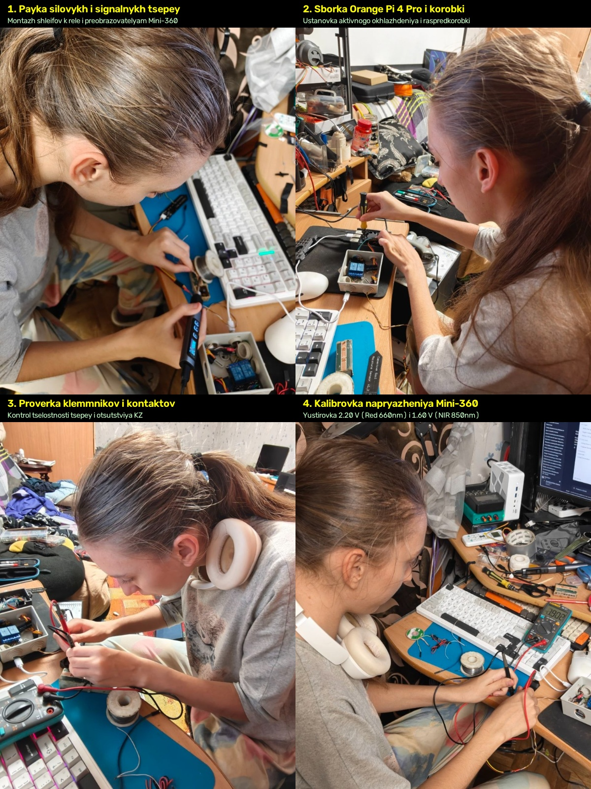  
* **Рис. 2.1.** Квадриптих ключевых этапов аппаратной сборки комплекса: пайка силовой проводки цифровой станцией, монтаж термоинтерфейса и охлаждения Orange Pi, прозвонка цепей мультиметром, прецизионная юстировка напряжений драйверов Mini-360.

| Пайка силовой коммутации | Монтаж охлаждения Orange Pi |
| :---: | :---: |
| 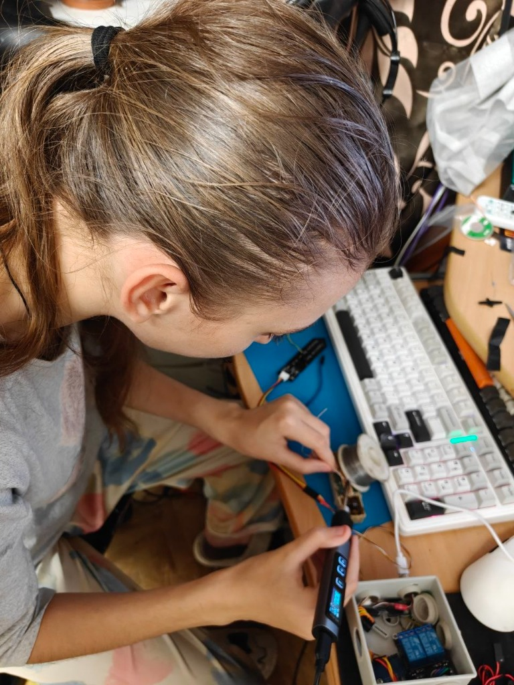 | 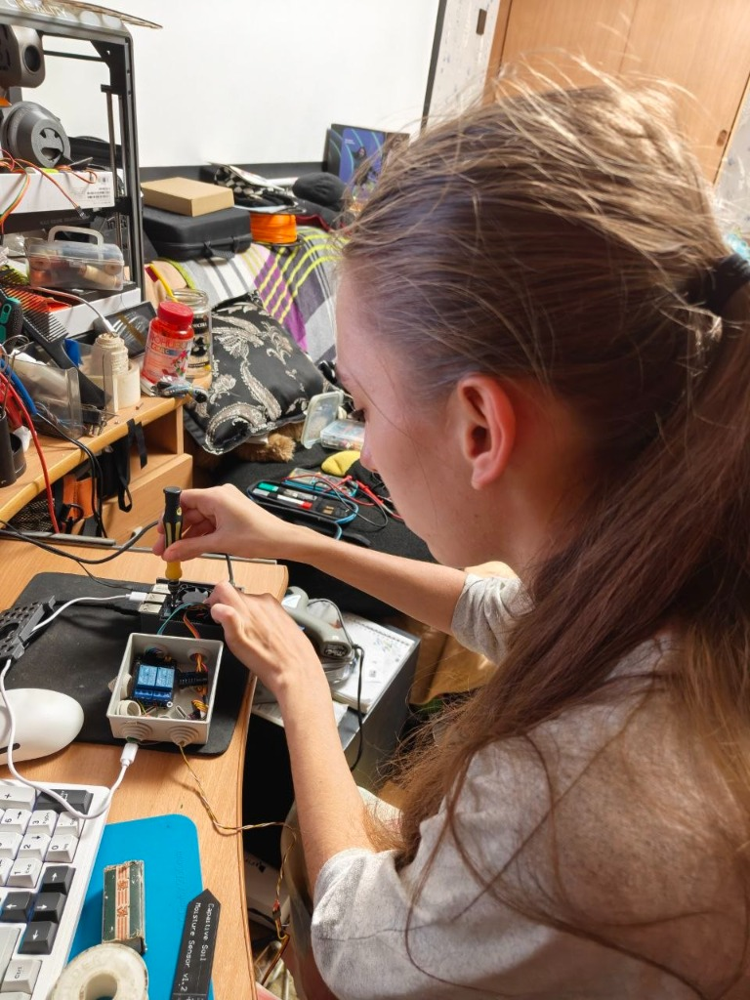 |
| **Рис. 2.2.** Пайка линий коммутации светодиодов 660/850 нм и силовых шин реле цифровой паяльной станцией. | **Рис. 2.3.** Установка радиаторов охлаждения и термоинтерфейса на процессор Allwinner платы Orange Pi 4 Pro. |

| Прозвонка цепей мультиметром | Калибровка напряжений Mini-360 |
| :---: | :---: |
| 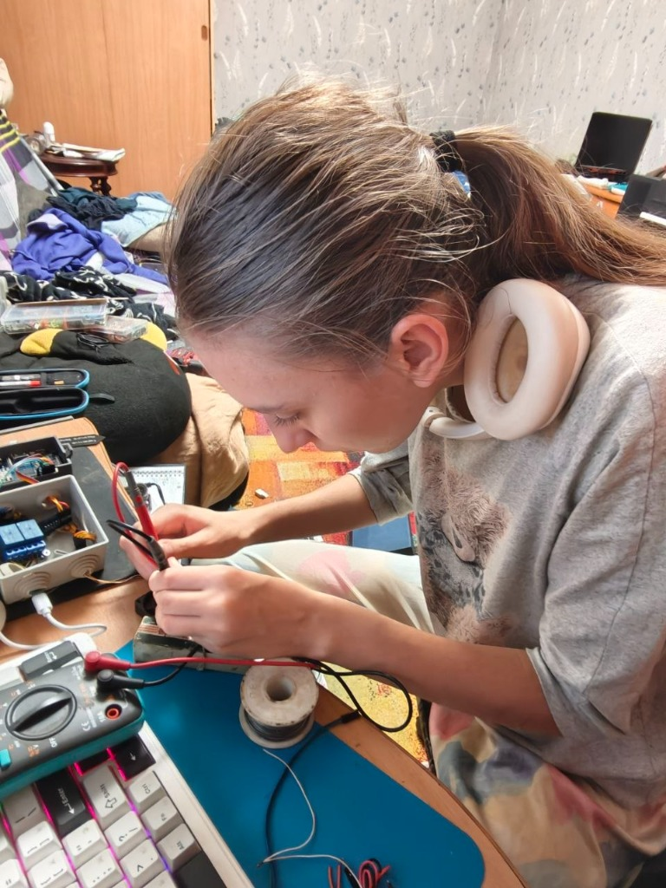 | 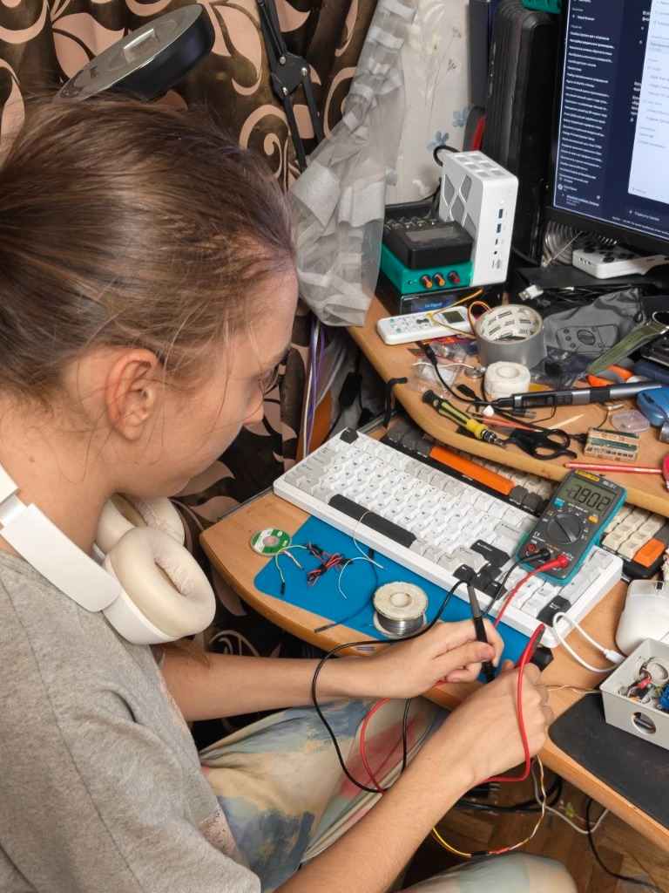 |
| **Рис. 2.4.** Контроль отсутствия коротких замыканий и проверка падения напряжения на логических уровнях. | **Рис. 2.5.** Настройка подстроечных резисторов Mini-360: фиксация ровно 2.20 В (Red) и 1.60 В (NIR). |

---

## Раздел 3. Биологический эксперимент и проростки *Pisum sativum*

Синхронная закладка серии из 5 экспериментальных когорт ($n = 45$) сорта «Альфа»:

| Макросъемка семян гороха | Подготовка почвенного субстрата |
| :---: | :---: |
| 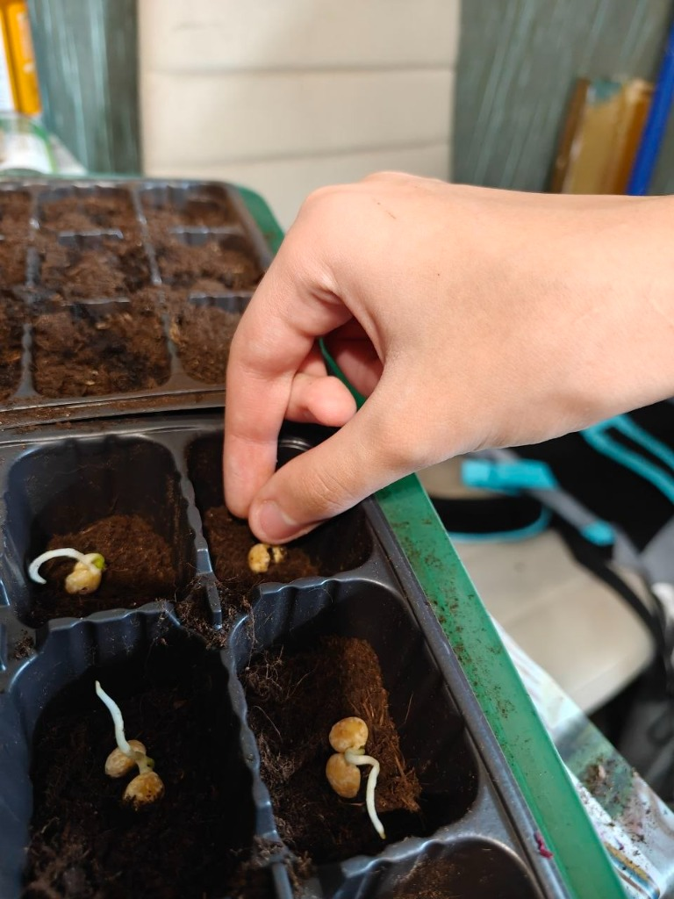 | 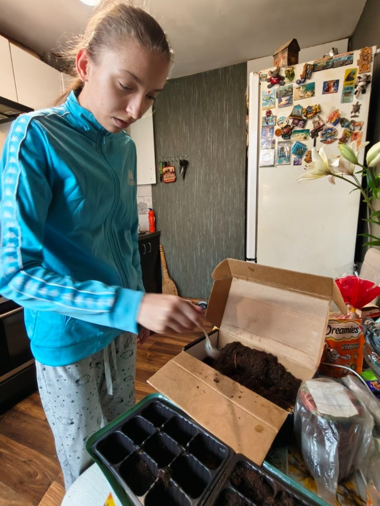 |
| **Рис. 3.1.** Отбор калиброванных пророщенных семян гороха сорта «Альфа» с длиной корешка 1.5–2.0 см. | **Рис. 3.2.** Подготовка раскисленного торфо-перлитового субстрата (pH 6.0) и равномерная набивка кассет. |

| Посев семян в кассеты 3х3 | Серия из 5 синхронных кассет под фитосветом |
| :---: | :---: |
| 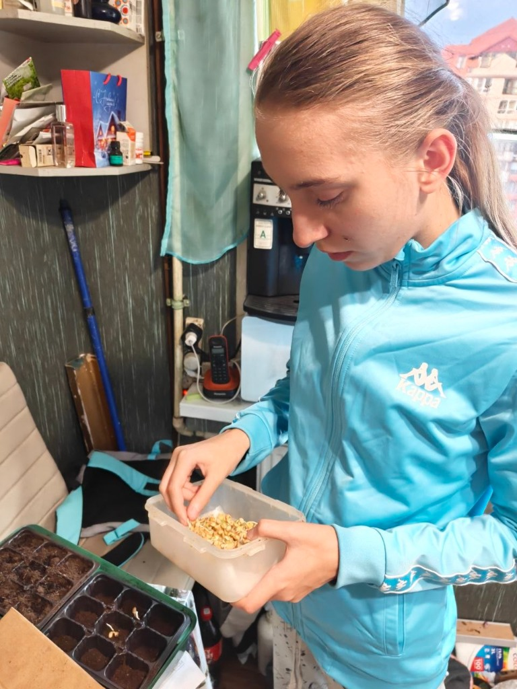 | 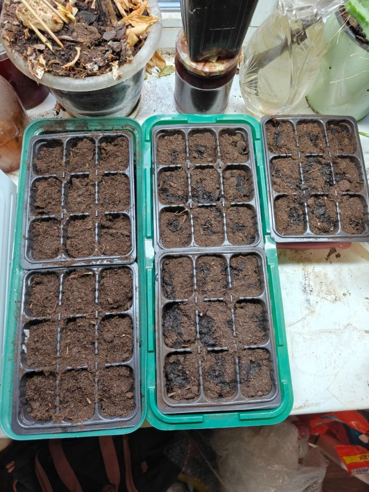 |
| **Рис. 3.3.** Посев семян на фиксированную глубину 1.5 см в 9 ячеек стандартизованной кассеты. | **Рис. 3.4.** Размещение 5 синхронных кассет ($n=45$) в камере доращивания под фитопанелью полного спектра. Кассета №2 установлена в изолированный поддон. |

-
> 📌 **Примечание**: Все оригиналы фотоснимков хранятся в высоком разрешении в каталоге [`docs/images/`](images/) и доступны для рецензирования экспертной комиссией конкурса «Большие вызовы».
